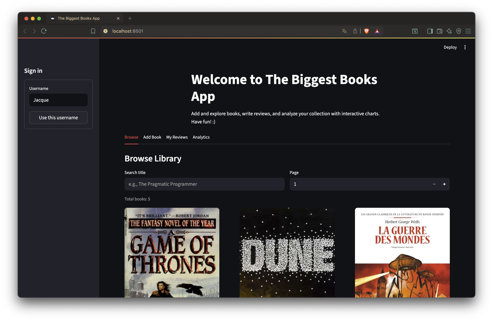
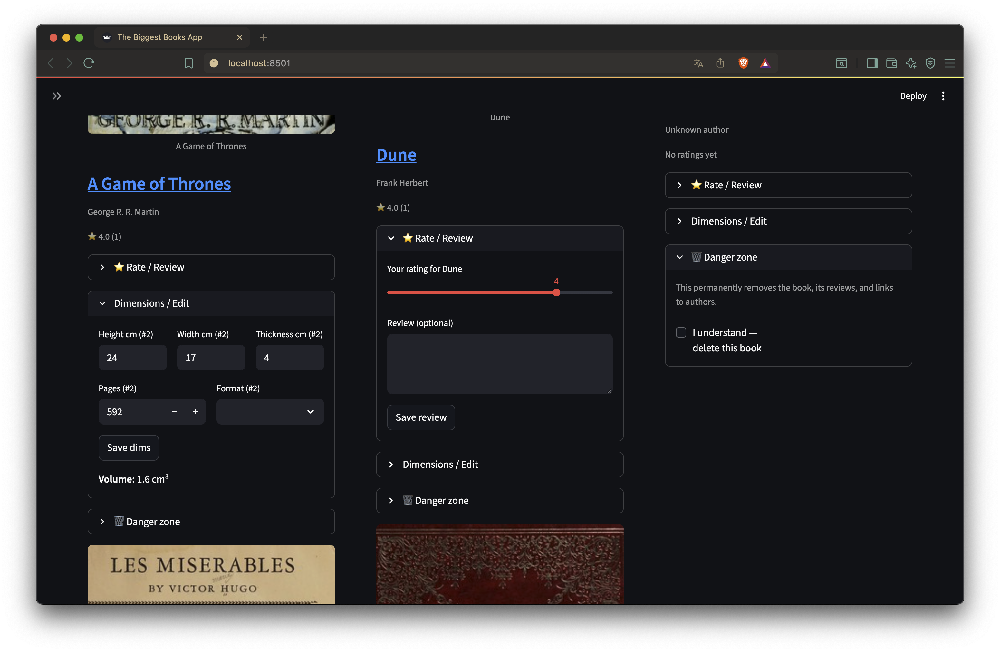
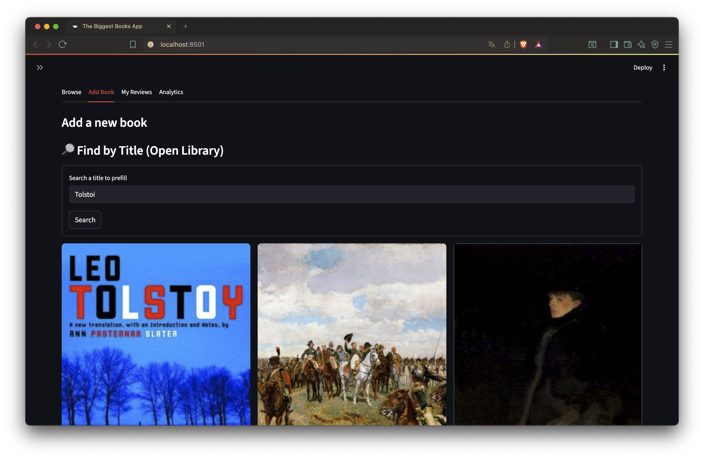
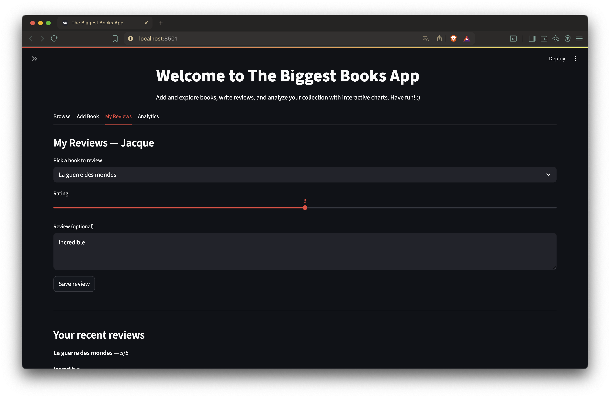
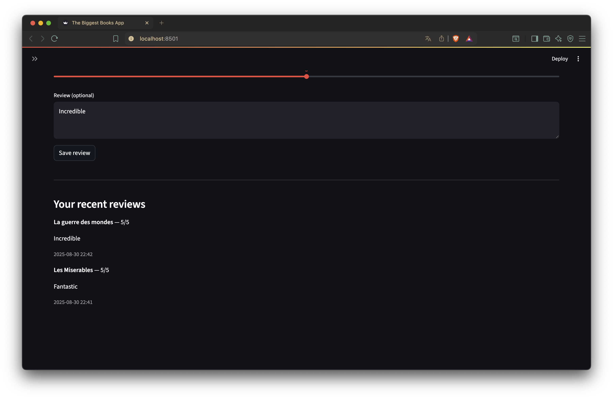
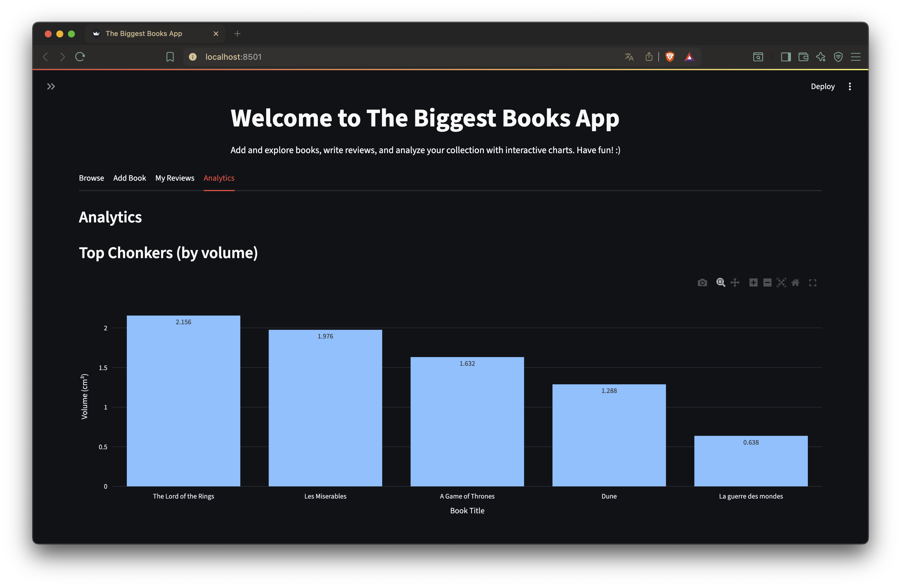
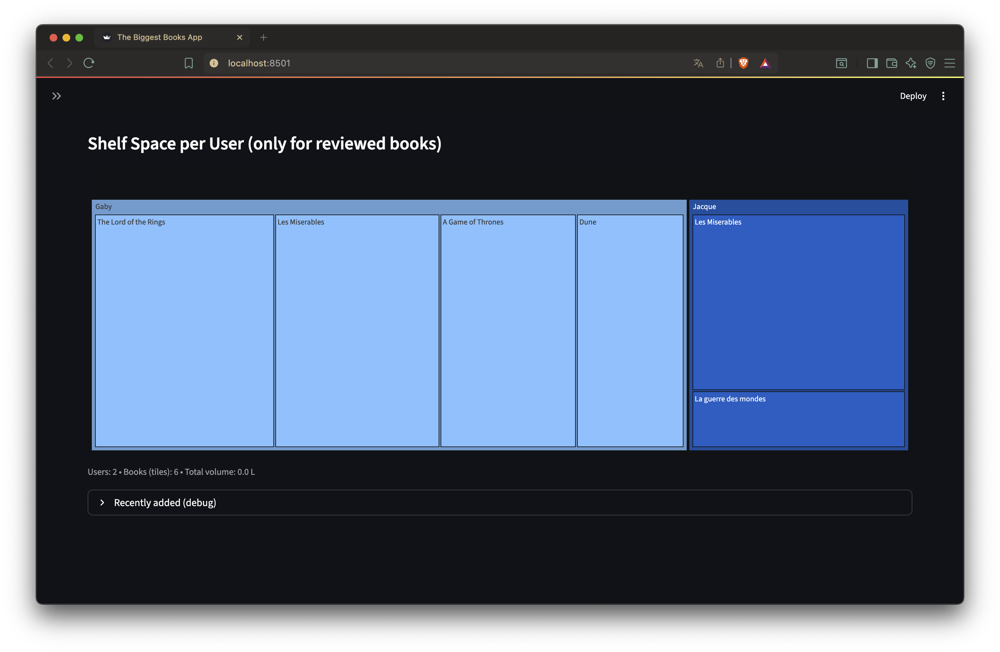

# The Biggest Book

A **Streamlit + SQLAlchemy** web app to manage and explore the biggest of the books.  
Add books from [Open Library](https://openlibrary.org/) or manually, track dimensions, write reviews, 
and check witch one is the biggest.

---

## Features

- **Search & Add Books**
  - Fetch metadata from **Open Library** by title (auto-prefill covers, authors, pages, dimensions)
  - Add books manually if not available
- **Browse Catalog**
  - Explore all books with covers, titles, and authors
  - Titles link to Open Library (if available)
- **Reviews**
  - Each user can leave ratings and optional text reviews
  - Average ratings + recent reviews shown inline
- **Dimensions & Volume**
  - Store height, width, thickness, and pages
  - Auto-compute volume (cm³) → find the **chonkers**
- **Analytics**
  - Largest books by volume
  - Shelf space per user (treemap)
- **SQL-powered backend**
  - SQLAlchemy ORM models for users, books, authors, and reviews
  - Default SQLite DB (`books.db`), easily swappable for Postgres/MySQL

---

## Tech Stack

- [Streamlit](https://streamlit.io/) — interactive UI
- [SQLAlchemy](https://www.sqlalchemy.org/) — ORM and schema
- [SQLite](https://sqlite.org) — default database
- [Pandas](https://pandas.pydata.org/) + [Plotly](https://plotly.com/python/) — analytics & charts
- [Open Library API](https://openlibrary.org/developers/api) — metadata harvester

---

## Screenshots

---

## 🖼️ Screenshots

<table>
<tr>
<td align="center">
<br/>
<b>Browse (1)</b>
</td>
<td align="center">
<br/>
<b>Browse (2)</b>
</td>
</tr>

<tr>
<td align="center">
<br/>
<b>Search (1)</b>
</td>
<td align="center">
<br/>
<b>Search (2)</b>
</td>
</tr>

<tr>
<td align="center">
<br/>
<b>Reviews (1)</b>
</td>
<td align="center">
<br/>
<b>Reviews (2)</b>
</td>
</tr>

<tr>
<td align="center">
<br/>
<b>Analytics (1)</b>
</td>
<td align="center">
<br/>
<b>Analytics (2)</b>
</td>
</tr>
</table>

---

## Project Structure

```bash
book/
├── app.py                 # main Streamlit entrypoint
├── dal.py                 # Data access layer (CRUD, queries, analytics SQL)
├── db.py                  # Session/engine setup
├── init_db.py             # DB initialization helper
├── init.py                # (placeholder / package init)
├── models.py              # SQLAlchemy ORM models
├── books.db               # SQLite database (auto-created)
├── tabs/                  # Streamlit tab modules
│   ├── add.py             # Add books (Open Library + manual)
│   ├── browse.py          # Browse catalog + inline reviews & edits
│   ├── analytics.py       # Charts and comparisons
│   └── reviews.py         # Review editor + user’s review list
├── harvesters/
│   └── openlibrary_client.py  # Client for Open Library API
├── LICENSE
└── README.md              # this file
```

---

## Getting Strated

```bash
git clone https://github.com/Grabyy/The_Biggest_Book.git
cd The_Biggest_Book
conda create -n book python=3.11 streamlit sqlalchemy pandas plotly requests
conda activate book
streamlit run app.py
```
---

## Database

Default: books.db (SQLite, created automatically).

To reset DB: delete books.db and run again, or use init_db.py.

To switch to Postgres/MySQL: update the connection string in db.py.
